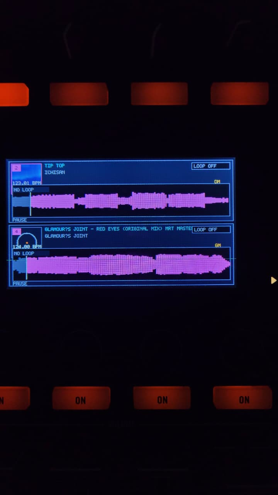
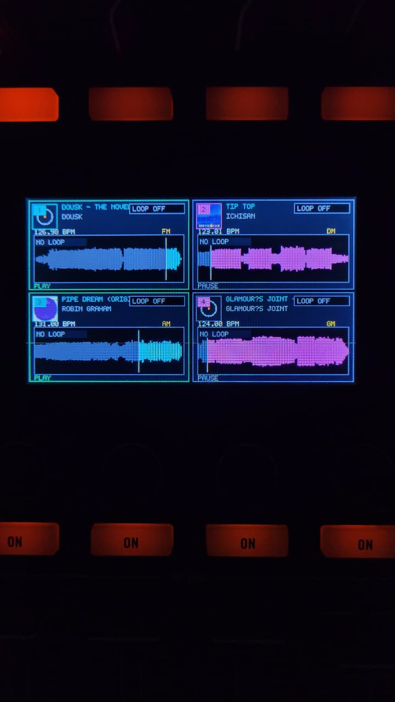
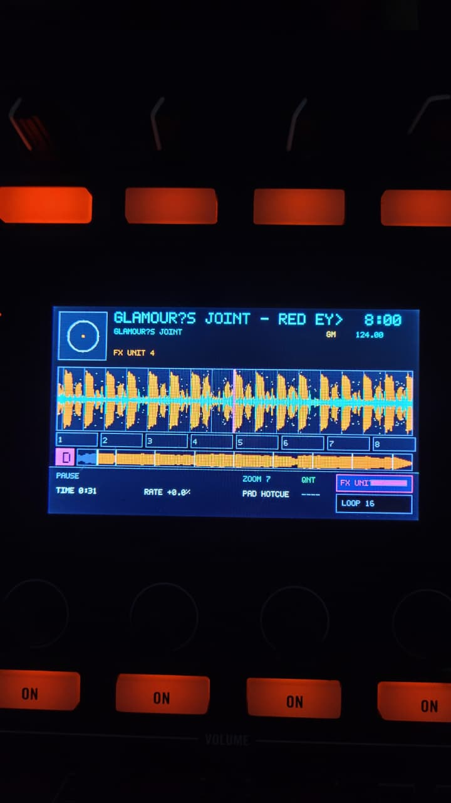
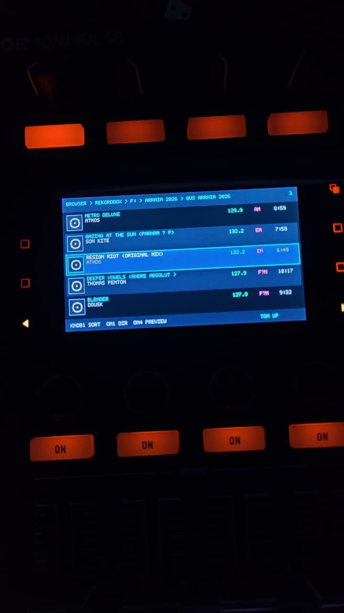
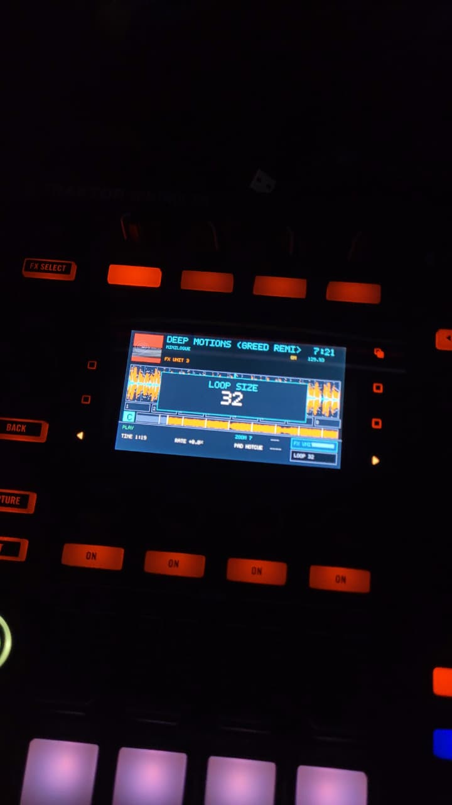

# Kontrol S8 for Mixxx — Cross-Platform Mappings

### Bringing the Traktor Kontrol S8 to Mixxx

Independent Mixxx mappings for the Native Instruments Traktor Kontrol S8, created by **gusgustavofreitas** with AI assistance.

This project provides a dedicated integration between the Kontrol S8 and Mixxx, combining physical controls, integrated displays, HID communication, LED feedback, and performance features. Its goal is to expand the possibilities of using the S8 with Mixxx while taking advantage of the controller's hardware.

### Companion Project — Hardware Protocol Reference

The independent hardware protocol documentation is maintained in a separate repository:

**[Traktor Kontrol S8 Hardware Protocol — Independent Reverse Engineering](https://github.com/gusgustavodj/kontrol-s8-protocol)**

It documents USB/HID communication, LEDs, displays, and supporting technical references. Developers working on additional platforms can consult the companion repository and its protocol evidence and platform-support notes.

**Windows is the initial implementation.** The project has a cross-platform scope; additional platform development and compatibility reports are welcome. This is neither an official Mixxx nor a Native Instruments distribution.

---

## 🎛️ Main Features

The Windows implementation includes the main mixing and performance controls directly on the Kontrol S8. The following confirmed functionality reflects the developer's physical-use declarations for the tested composition, not universal compatibility across systems or Mixxx builds.

### Four-Deck Control

- Deck A/C and B/D switching, PLAY / PAUSE, and momentary CUE.
- SYNC and MASTER controls and track loading into the corresponding deck.
- Four-deck visualization on the integrated displays.

*Two-deck display layout.*

*Four-deck display layout.*

FLUX/Slip Mode is implemented but has not yet been tested.

### Mixer and Audio

- Four independent channel faders and crossfader.
- Channel GAIN, three-band EQ, FILTER, and PFL/CUE headphone monitoring.
- PFL, Mixer FX, and per-deck FX 1/2 assignment LED feedback.
- MASTER and MONITOR audio outputs confirmed in the tested setup.

Microphone, Booth, and recording functionality have been reported as functional by the developer. The S8's stand-alone mixer and Direct Thru operation have also been confirmed; these are existing hardware capabilities retained in the tested setup rather than features created by the mappings.

### Performance Controls and FX

- Hotcues 1–8: creation, triggering, and deletion.
- Loop control and LOOP ROLL.
- Functional FREEZE and SLICER adaptations for Mixxx.
- Touchstrip, TEMPO encoder, and FX Units 1 and 2.

Beatjump is partially functional: jumps are not yet correctly quantized. Individual Hotcue pad colors are planned for a future version; other transport and pad LEDs are confirmed. Backspin/Hold behavior and advanced FX have not been tested.

---

## 🖥️ Integrated Displays

Both Kontrol S8 displays present Mixxx information, including:

- Track waveforms, overview, playback information, and status.
- Browser navigation and FX selection/control views.
- Four-deck visualization, track-loading pop-ups, and event pop-ups.
- **Four customizable waveform styles**, an addition introduced by this implementation.

*Track deck view: waveform, position, and playback information.*

*Music library Browser on the physical display. Browser Preview and Track Sorting still require adjustments.*

The display bridge uses real Mixxx data. When information is unavailable, it can show contextual notices rather than simulate unavailable musical data.

*Example of an event pop-up displayed on the controller.*

---

## ⚙️ Additional Features

Dedicated preferences allow users to customize waveform presentation, Browser row count, BPM precision, color palette, and preview seek behavior. Confirmed operational safeguards address cases associated with track loading, deck switching, Beatgrid availability, and slice updates.

The implementation combines HID controls, LED feedback, and Display/Bulk communication. The adapter and decoder are embedded in the mapping JavaScript files; separate helper scripts from older bundles are not required.

Read the [complete Release Notes](docs/release-notes.md) for the full feature description and distinctions between functional, partial, unsupported, and untested behavior.

---

## 🚧 Known Limitations

| Feature | Current status |
| --- | --- |
| Browser Preview and Track Sorting | Partially functional; adjustments planned. |
| Beatjump | Partially functional; jumps are not properly quantized. |
| Hotcue pad colors | Individual Hotcue colors not yet implemented. |
| Quantize | Visual feedback works, but musical behavior is not correctly implemented. |
| REMIX / Samplers | Not functional; future implementation. |
| CAPTURE; Step Sequencer; four-part Stems | Not supported in this version. |
| Advanced Remix controls | Physical controls exist; functional equivalent not yet implemented. |
| Automatic Stem Generation | Not supported; depends on Mixxx implementation. |
| Key Lock; SNAP; Beatgrid Editing | Not supported; future implementation. |
| STEMS / Phrasing / Settings screens | Corresponding functions planned for future implementation. |

FLUX/Slip, Backspin/Hold, and advanced FX remain untested. Physical buttons and display elements do not establish their original Traktor functionality. See [Known Limitations](docs/known-limitations.md).

---

## 💻 Platform Support

| Platform | Status |
| --- | --- |
| Windows | Initial implementation; developer-confirmed operation in the tested configuration. |
| Android | Separate implementation reported as functional but partial; not included in this repository package. |
| Linux | Not tested; compatibility not established. |
| macOS | Not tested; compatibility not established. |

Android publication is planned separately; no Android APK or committed release date is provided here. Platform compatibility is independent. See [Platform Support](docs/platform-support.md) and [Compatibility](docs/compatibility.md).

---

## 🔧 Windows Installation

The documented Windows implementation includes **four mapping files** and a separate source patch for the HID/Bulk display bridge. The exact Mixxx base commit is:

`3ebac449e7e5fe2a0186596657696e87ce8b0e56`

The documented full HID/Bulk functionality is **not available in an unmodified official Mixxx installation**. Apply and build the patch against the specified source revision, with HID/Bulk support, following the installation guide. The patch is distributed separately from the four mapping files under applicable GPL-2.0-or-later terms.

| Interface | Mapping files |
| --- | --- |
| HID | `windows/mappings/HID/Kontrol-S8-Mixxx-Windows-v1.0.hid.xml` |
| HID | `windows/mappings/HID/Kontrol-S8-Mixxx-Windows-v1.0.js` |
| Display/Bulk | `windows/mappings/DISPLAY/Kontrol-S8-Mixxx-Windows-v1.0.bulk.xml` |
| Display/Bulk | `windows/mappings/DISPLAY/Kontrol-S8-Mixxx-Windows-v1.0-display.js` |

The revised 7000 ms text-only splash passed static rendering checks; no new physical inspection specific to that splash is recorded in the original publication documentation. No modified Mixxx executable, complete source tree, Android APK, or installer is included.

Read [Windows Installation](docs/installation-windows.md), [Patch Documentation](windows/patch/README.md), and [Compatibility](docs/compatibility.md). Compatibility with other Mixxx revisions is not automatically established.

---

## 📖 Documentation

- [Full Release Notes](docs/release-notes.md)
- [Controls and Output](docs/controls.md)
- [Windows Installation](docs/installation-windows.md)
- [Compatibility](docs/compatibility.md)
- [Platform Support](docs/platform-support.md)
- [Known Limitations](docs/known-limitations.md)
- [Development Status](docs/development-status.md)
- [Hardware Protocol Reference — Independent Reverse Engineering](https://github.com/gusgustavodj/kontrol-s8-protocol)

---

## 🤝 Contributing

Contributions are welcome through [GitHub Issues](https://github.com/gusgustavodj/kontrol-s8-mixxx-mappings/issues) and [Pull Requests](https://github.com/gusgustavodj/kontrol-s8-mixxx-mappings/pulls). Report bugs, mapping improvements, compatibility results, or requests for additional platforms. See [CONTRIBUTING.md](CONTRIBUTING.md) and the templates in `.github/`. Do not post private captures or proprietary materials.

Contributions are reviewed before incorporation. The maintainer decides whether changes enter the official repository; Issues and Pull Requests do not create an obligation to implement, accept or merge a proposal.

---

## 📜 License and Notices

The independent mapping XML/JS code is licensed under GPL-2.0-or-later; see [LICENSE](LICENSE). The separately distributed patch contains/changes Mixxx source and follows applicable GPL-2.0-or-later obligations, upstream notices, exact base revision, and source references; see [COPYING](COPYING), [NOTICE.md](NOTICE.md), and [Patch Documentation](windows/patch/README.md). Third-party marks and materials are not relicensed.

This independent project is not affiliated with, endorsed by, or officially supported by Native Instruments or the Mixxx project.

**Kontrol S8 + Mixxx — Independent Development.**
